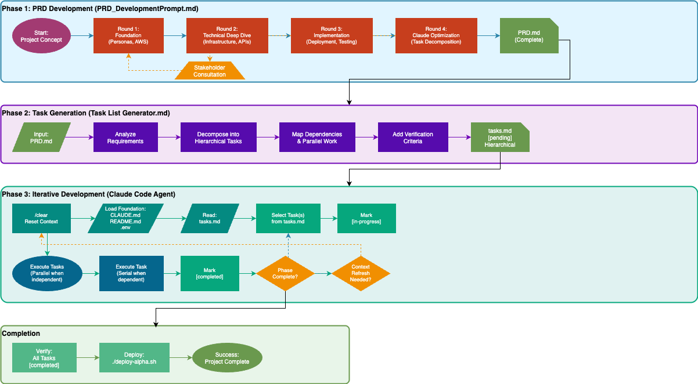

# ContextEng

Claude Code templates and configurations for AWS-based projects.

## Getting Started

1. Copy template files to your project, or git clone this repo
   * If cloning, delete the `.git` folder to start fresh
2. Customize `CLAUDE.md` with your project details
   * Replace placeholders: YOUR_APP, DATA_SOURCE_1, etc.
   * Set your architecture, standards, and preferences
3. Create PRD.md and tasks.md using included tools
4. Let Claude Code build your alpha by iterating through tasks!

## Purpose

This repository provides templates for managing context in AI code writing tools such as Claude Code. These templates establish project guidelines, structure conventions, and development practices that enable AI assistants to work effectively on your codebase.

Context window management is critical in AI-assisted development because of two dangerous phenomena: **context rot** (critical project details get pushed out or buried as the context fills) and **catastrophic forgetting** (polluted context causes mistakes and contradictions). Without management, AI quality degrades over time. The solution is regular use of `/clear` combined with *context priming*: clear context, then reload core project files (README.md, CLAUDE.md, tasks.md, .env) to ensure the AI always starts with fresh, accurate information about your project.

## Workflow

The development workflow is designed around a fundamental principle: humans are not good at being clear about what they want. Agentic AI coding assistants are aggressive about achieving their goals. Claude Code works best when given clear requirements, structured tasks, and minimal, focused context. This approach transforms software development from ad-hoc prompting into a systematic process that produces consistent, high-quality results.



### 1. Create Your PRD

The process begins with writing a well-articulated Product Requirements Document ("PRD.md"). A [PRD development prompt](docs/PRD_DevelopmentPrompt.md) is provided to guide you through creating comprehensive requirements optimized for AI models.

**Why this matters**: This initial phase should not be rushed. Iterating with the prompt for several days is recommended because this foundation determines your project's success. A clear PRD gives the AI assistant the context it needs to make intelligent decisions throughout development. During this time, speak with stakeholders to capture diverse perspectives and integrate your knowledge of both traditional and agentic AI software development.

### 2. Generate Task List

Once your PRD is finalized and stakeholders have approved the requirements, use the [Task List Generator](docs/TaskListGenerator.md) to create a comprehensive task list. This generator transforms your PRD into a structured, hierarchical roadmap that identifies dependencies and highlights opportunities for parallel execution through sub-agents.

**Why this matters**: Breaking work into clear, discrete tasks allows you to maintain minimal context in each session. The AI assistant can focus on one specific objective at a time, leading to better code quality and fewer errors.

### 3. Development Phase with Context Management

Now you're ready to develop code. The development phase follows a disciplined approach to context management that maximizes AI effectiveness. Once your tasks.md exists, you enter an iterative cycle:

**The Pattern**:
- Clear context before each phase with `/clear`
- Load foundational documents: CLAUDE.md (project-specific instructions and standards), README.md (project overview), and .env (configuration details)
- Work through tasks systematically
- Clear and refresh when encountering complex problems, hitting rate limits, or reaching 80% context capacity

**Why this works**: Continually clearing and refreshing context prevents context pollution and ensures your AI agent maintains focus on current objectives. This flexibility, combined with strategic use of commands like `/clear`, `/context`, `/compact`, and `/resume`, provides significant performance improvements. Use `/status` regularly to understand current context state.

Git commit after each phase or significant milestone to preserve your progress.

### 4. Completion and Next Steps

The cycle continues until all tasks reach completion. Each iteration strengthens the codebase while maintaining alignment with your original requirements. Finally, with all tasks marked as completed, move to comprehensive human verification, UX testing, and deployment.

When all specified tasks are completed but more work is needed, you have two approaches: archive the original task list and create a new one from scratch, or create a next_steps.md file using the same process.

## What's Included

### Core Templates
- **[CLAUDE.md](CLAUDE.md)** - Project instructions, architecture, and directives for Claude Code
- **[README.md](README.md)** - Repository documentation and workflow guide
- **[env.example](env.example)** - Environment variable template

### Configuration
- **[.claude/settings.json](.claude/settings.json)** - Claude Code configuration for MCP servers and hooks
- **[.claude/settings.local.json](.claude/settings.local.json)** - Local settings override (gitignored)

### Documentation
- **[docs/PRD_DevelopmentPrompt.md](docs/PRD_DevelopmentPrompt.md)** - Guide for creating Product Requirements Documents
- **[docs/TaskListGenerator.md](docs/TaskListGenerator.md)** - Transform PRDs into structured task lists
- **[docs/UV Setup.md]("docs/UV Setup.md")** - Python UV package manager setup guide
- **[docs/WORKFLOW_NARRATIVE.md](docs/WORKFLOW_NARRATIVE.md)** - Detailed workflow documentation

### Diagrams
- **[docs/images/CompleteWorkflow.png](docs/images/CompleteWorkflow.png)** - PRD → Tasks → Development visual
- **[docs/images/AI_Development_Workflow.png](docs/images/AI_Development_Workflow.png)** - Process visualization

### Utilities
- **[utils/generate_workflow_diagram.py](utils/generate_workflow_diagram.py)** - Generate workflow diagrams
- **[utils/workflow_diagram_highlevel.py](utils/workflow_diagram_highlevel.py)** - Generate high-level diagrams
- **[utils/requirements.txt](utils/requirements.txt)** - Python dependencies

## Benefits

- **Consistent AI behavior across team members** - Everyone follows the same patterns
- **Reduced repetitive instructions** - Context documents eliminate re-explaining architecture
- **Enforced development standards** - CLAUDE.md ensures consistent code quality
- **Defined architectural patterns** - Clear structure prevents ad-hoc decisions
- **Structured debugging workflows** - Systematic approach to problem-solving

## Memory Management

### Core Principles

Context window size directly impacts AI assistant performance. Effective context management can improve performance by 39% according to [Anthropic research](https://www.anthropic.com/news/context-management). Understanding how to manage context is essential for productive AI-assisted development.

### Essential Commands

**`/clear`** - Reset context window between tasks. Use regularly to maintain performance.

**`/context`** - Inspect token usage and optimize MCP tools.

**`/compact`** - Compress current session to reduce token count (processing time: 1+ minutes).

**`/resume`** - Switch between previous sessions.

### File Organization Strategy

**Project Memory (CLAUDE.md)**: Keep project-specific guidelines minimal to reduce token consumption. These are loaded at session start and follow a cascaded system approach ([Claude Code best practices](https://www.anthropic.com/engineering/claude-code-best-practices)).

**Ad-Hoc Documentation (docs/)**: Store occasional-use information separately. Reference via `@docs/filename.md` to avoid loading unnecessary content. Load context on-demand for complex analysis.

**Why this matters**: By structuring information into "always needed" (CLAUDE.md) and "sometimes needed" (docs/), you minimize token usage while keeping critical information readily available.

### Context Engineering Patterns

Effective context engineering follows four core strategies:

1. **Writing** - Create persistent information stores
2. **Selecting** - Load relevant information when needed
3. **Compressing** - Minimize token usage
4. **Isolating** - Structure information by concern

**Implementation tips**:
- Break tasks into discrete units; use `/clear` between completions
- Delegate verification and investigation to subagents
- Maintain examples folder for pattern reference
- Document session context before closing
- Import only relevant code sections
- Preserve project hierarchy in references

### Advanced Features

**Context Editing**: Automatically removes stale tool calls when approaching token limits. Reduces token consumption by 84% in extended sessions. [Details](https://www.anthropic.com/news/context-management)

**Memory Tool**: File-based storage for information outside the context window. Maintains knowledge bases and project state across sessions.

**Context Awareness**: Claude Sonnet 4.5 and Haiku 4.5 track remaining context window throughout conversations, helping you manage resources effectively.

## MCP (Model Context Protocol)

Model Context Protocol enables Claude Code to connect to external data sources, tools, and services through standardized servers. MCP servers extend Claude's capabilities beyond built-in tools, allowing integration with databases, cloud services, and specialized APIs.

**WARNING** - MCP servers degrade AI agent efficiency. Add them when needed, remove them immediately when done. Unused or irrelevant MCP servers added either to your coding client or agents themselves hog context memory, encouraging context rot and catastrophic forgetting.

### Common MCP Servers
- **[AWS](https://github.com/awslabs/mcp)**: Of course

But also:
- **[Apify](https://docs.apify.com/platform/integrations/mcp)**: Run Actors from Apify Store and access web scraping/automation results
- **[Browser](https://browsermcp.io)**: Local browser automation for testing and task execution
- **[Database](https://github.com/modelcontextprotocol/servers)**: Direct database queries (PostgreSQL, SQLite, etc.)
- **[Filesystem](https://github.com/modelcontextprotocol/servers/tree/main/src/filesystem)**: Access local files and directories outside the project
- **[Git](https://github.com/modelcontextprotocol/servers/tree/main/src/git)**: Enhanced git operations and repository management
- **[GitHub](https://github.com/modelcontextprotocol/servers)**: Repository management, issues, and pull request operations
- **[Puppeteer](https://github.com/modelcontextprotocol/servers/tree/main/src/puppeteer)**: Web page automation and interaction
- **[Ref](https://ref.tools/mcp)**: Token-efficient documentation search for APIs, libraries, and frameworks
- **[Sequential Thinking](https://github.com/modelcontextprotocol/servers/tree/main/src/sequentialthinking)**: Structured step-by-step reasoning with revision and branching support
- **[Stripe](https://docs.stripe.com/mcp)**: Payment processing, customer management, and Stripe API integration
- **[Supabase](https://supabase.com/docs/guides/getting-started/mcp)**: Project creation, database queries, and schema management
- **[Web Search](https://github.com/modelcontextprotocol/servers/tree/main/src/brave-search)**: Internet search capabilities

### Best Practices

**Minimal Installation**: Only install MCP servers you actively need. Each server consumes memory and may add latency.

**Security**: MCP servers access credentials and resources defined in settings. Review permissions before installation. Use least-privilege principles. Never commit MCP credentials to version control.

**Performance**: MCP tools appear in Claude's tool list and consume context. Disable unused servers to reduce context pollution. Use built-in Claude Code tools when possible.

**When to Use MCP**: Access external databases or APIs not in your codebase. Integrate with third-party services (Slack, GitHub API). Use specialized tools not available in built-in toolset. DO NOT use MCP for basic file operations—use built-in tools instead.

**Example Configuration**:
```json
{
  "mcpServers": {
    "aws": {
      "command": "npx",
      "args": ["-y", "@anthropic/mcp-server-aws"],
      "env": {"AWS_REGION": "us-west-2"}
    }
  }
}
```

## Claude Code Customization

### Settings Configuration (.claude/settings.json)

The `.claude/settings.json` file is your central configuration for all Claude Code customizations. It controls MCP servers, hooks, and behavioral settings.

**Purpose**: Configure MCP servers for external integrations, define hooks for automated validation and security checks, set project-specific preferences, and control context management settings.

**Why this matters**: Centralizing configuration in version control ensures team consistency while allowing individual customization through `.claude/settings.local.json` (gitignored).

**Best Practices**:
- Commit `.claude/settings.json` to share team configuration
- Use environment variables for sensitive credentials
- Never commit API keys or tokens directly
- Test settings changes in isolation before committing
- Monitor settings impact with `/context` command

### Skills

Skills are reusable capabilities that extend Claude Code's functionality. Defined in `.claude/skills/` directory, each skill is a markdown file containing instructions that Claude can invoke.

**When to Create Skills**: For repetitive complex workflows (deployment, testing pipelines), domain-specific expertise (data analysis, security scanning), multi-step processes needing consistent execution, or cross-project capabilities you want to reuse.

**Why this works**: Skills encapsulate expertise that would otherwise need to be repeatedly explained. Once defined, you can invoke them instantly, ensuring consistent execution every time.

### Custom Slash Commands

Slash commands are project-specific shortcuts defined in `.claude/commands/` directory. Each command is a markdown file—the file name becomes the command (e.g., `review-pr.md` becomes `/review-pr`).

**Common Use Cases**: Code review workflows (`/review-pr`), testing shortcuts (`/run-tests`), deployment procedures (`/deploy-staging`), documentation generation (`/update-docs`), debugging workflows (`/debug-errors`).

**Why this works**: Slash commands enforce standards and workflows. Instead of remembering to ask Claude to "check code quality, verify tests, identify bugs, and suggest improvements," you just type `/review-pr` and get consistent, comprehensive reviews every time.

**Example Command** (`.claude/commands/review-pr.md`):
```markdown
Review the current pull request:
1. Check code quality and style compliance
2. Verify test coverage
3. Identify potential bugs or security issues
4. Suggest improvements
5. Provide summary of findings
```

### Hooks

Hooks are shell commands that execute automatically in response to Claude Code events. Configured in `.claude/settings.json`, they enable automated validation, security scanning, and guardrails.

**Available Hooks**:
- `user-prompt-submit-hook`: Runs before processing user prompts
- `tool-call-hook`: Runs before tool execution
- `response-hook`: Runs after Claude generates responses

**Common Use Cases**: Validate code style before commits, scan for secrets or vulnerabilities, auto-format code, prevent dangerous operations in production, track tool usage and changes.

**Why this works**: Hooks catch issues before they happen. A hook that blocks `rm -rf` commands in production prevents disasters. A hook that scans for exposed API keys prevents security breaches. Automation ensures consistency that manual checks can't match.

**Best Practices**: Keep hooks fast (< 1 second) to avoid blocking. Return non-zero exit codes to block operations. Use hooks for validation, not transformation. Test thoroughly—they run on every action.

**Security Warning**: Hooks execute shell commands with your user permissions. Only use trusted hook scripts and review them carefully.

### Customization Strategy

**Start Simple**: Begin with standard Claude Code tools. Add slash commands for common workflows. Introduce MCP servers only when needed. Implement hooks for critical validations.

**Avoid Over-Engineering**: Don't create slash commands for one-time tasks. Don't install MCP servers for capabilities built into Claude. Don't use hooks where manual checks suffice. Keep customizations maintainable and documented.

**Why this approach**: Customization is powerful but adds complexity. Start minimal and add only what provides clear value. Your team will thank you for keeping things simple and maintainable.

## AWS Integration

**[Amazon Q Developer](https://aws.amazon.com/q/developer/)** - AI coding assistant for AWS with 37-60% code acceptance rates. Supports Python, Java, JavaScript, TypeScript, C#, Go, Rust, PHP, Ruby, Kotlin, C, C++, shell scripting, SQL, Scala, JSON, YAML, HCL.

**[AWS MCP Servers](https://aws.amazon.com/blogs/machine-learning/introducing-aws-mcp-servers-for-code-assistants-part-1/)** - Model Context Protocol servers for AWS development workflows including IaC translation, security scanning, CI/CD, and compliance.

## Resources

### Official Documentation
- [Claude Code Documentation](https://docs.claude.com/en/docs/claude-code)
- [Getting Started with Claude Code](https://docs.claude.com/en/docs/claude-code/getting-started)
- [Claude Code Best Practices](https://www.anthropic.com/engineering/claude-code-best-practices)
- [Claude Code on AWS Bedrock](https://aws.amazon.com/bedrock/claude/)
- [Model Context Protocol (MCP) Documentation](https://modelcontextprotocol.io/)
- [MCP Servers Repository](https://github.com/modelcontextprotocol/servers)

### Learning Resources

**Context Engineering**:
- [Context Engineering for AI Agents](https://www.anthropic.com/engineering/effective-context-engineering-for-ai-agents)
- [Practical Context Engineering](https://abvijaykumar.medium.com/practical-context-engineering-for-vibe-coding-with-claude-code-6aac4ee77f81)
- [Memory Management Tips](https://www.geeky-gadgets.com/claude-code-memory-management-tips/)

**Thought Leaders**:
- [IndyDevDan](https://www.youtube.com/@indydevdan) - Agentic engineering and principled AI coding. Courses: [PAIC](https://agenticengineer.com/principled-ai-coding), [TAC](https://agenticengineer.com/tactical-agentic-coding)
- [Cole Medin](https://github.com/coleam00) - Context engineering resources. [Context Engineering Introduction](https://github.com/coleam00/context-engineering-intro)

## Contributing

Submit issues or pull requests to improve these templates.
